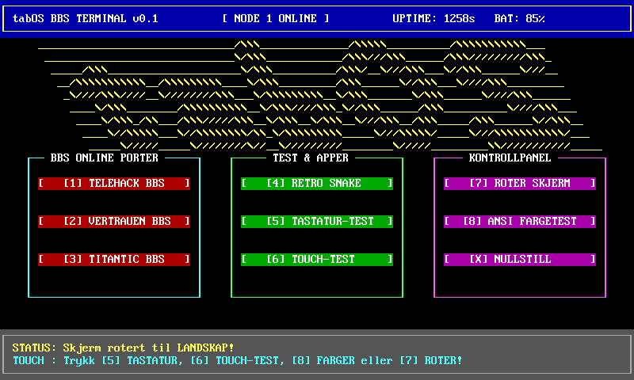
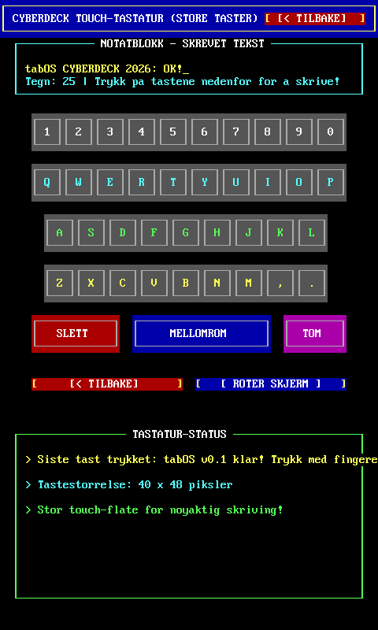
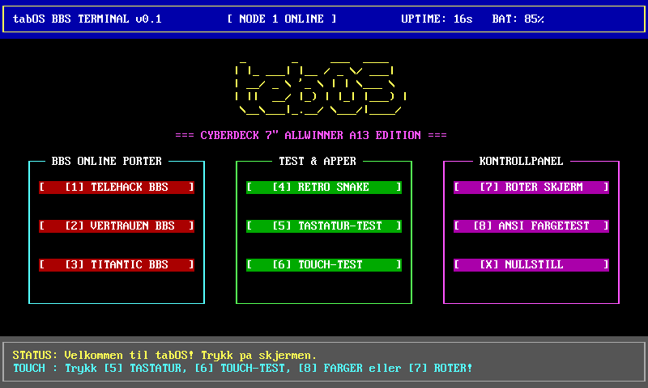
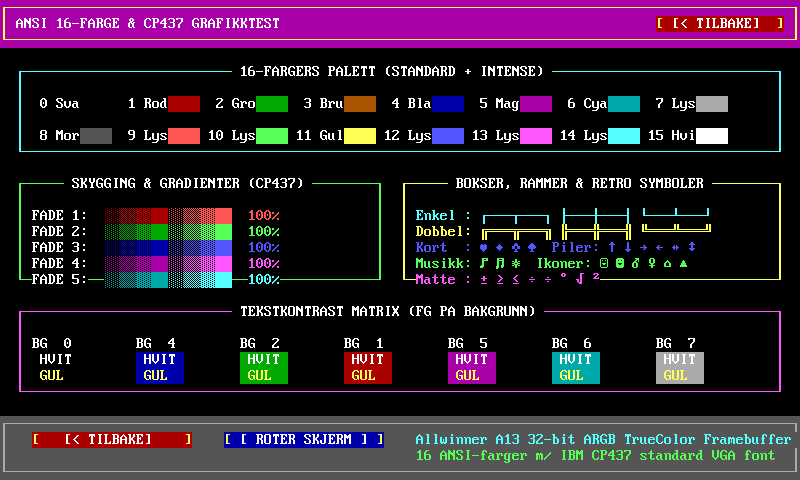
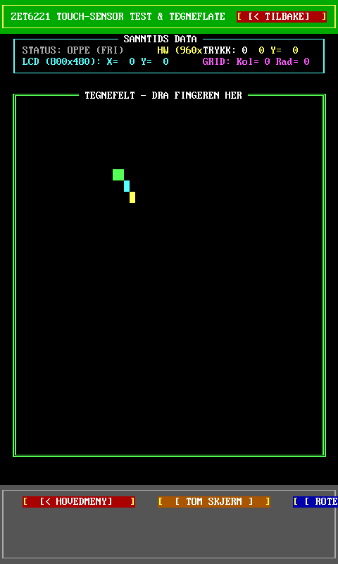

# tabOS - Cyberdeck OS for Allwinner A13 Nettbrett

```text
_______________________________/\\\______________/\\\\\__________/\\\\\\\\\\\___        
 ______________________________\/\\\____________/\\\///\\\______/\\\/////////\\\_       
  _____/\\\_____________________\/\\\__________/\\\/__\///\\\___\//\\\______\///__      
   __/\\\\\\\\\\\__/\\\\\\\\\____\/\\\_________/\\\______\//\\\___\////\\\_________     
    _\////\\\////__\////////\\\___\/\\\\\\\\\__\/\\\_______\/\\\______\////\\\______    
     ____\/\\\________/\\\\\\\\\\__\/\\\////\\\_\//\\\______/\\\__________\////\\\___   
      ____\/\\\_/\\___/\\\/////\\\__\/\\\__\/\\\__\///\\\__/\\\_____/\\\______\//\\\__  
       ____\//\\\\\___\//\\\\\\\\/\\_\/\\\\\\\\\_____\///\\\\\/_____\///\\\\\\\\\\\/___ 
        _____\/////_____\////////\//__\/////////________\/////_________\///////////_____
```

**tabOS** er et spesialbygget, lynraskt og selvstendig operativsystem/kjerne skrevet i ren C99 for eldre 7-tommers nettbrett basert på **Allwinner A13 (sun5i Cortex-A8)** prosessoren.

Systemet kutter ut hele Android-rammeverket (ingen Java VM, ingen SurfaceFlinger, ingen X11 eller Wayland) og snakker **direkte med maskinvaren**:
* **0 ms latens:** Direkte minnekartlegging (`mmap`) til LCD-skjermens framebuffer (`/dev/graphics/fb0`).
* **Maskinvare touch:** Interrupt-drevet lesing av Zet6221 I2C kapasitiv touch-sensor (`/dev/input/event2`).
* **90° Skjermrotasjon:** Sanntids matematisk rotasjon mellom Landskap ($100 \times 30$ tegn) og Portrett ($60 \times 50$ tegn).
* **Norske tegn:** Full støtte for Æ, Ø, Å via IBM CP437 og nordisk CP865 bitmap-rasterisering.
* **8-bit Lydmotor:** Direkte styring av Allwinner `sun5i-CODEC` og maskinvareforsterker (PA) over GPIO `PG10`.
* **Trådløs BBS:** Innebygd streaming-terminal for **Telehack BBS** (`telehack.com:23`) over integrert Wi-Fi (Realtek RTL8188eu).

---

## Skjermbilder fra Nettbrettet

### 1. tabOS Hovedmeny (Landskapsmodus - 800x480)


### 2. Touch-tastatur (Portrettmodus - 480x800)
Med store touch-taster ($40 \times 48$ piksler) tilpasset tomler og fingre:


### 3. Retro Snake Arkadespill
Kvadratisk $22 \times 22$ spillflate ($352 \times 352$ px), doble tommelknapper og ekte 8-bit retro-lydeffekter:


### 4. ANSI Farge- og Grafikktest
Full demonstrasjon av 16 ANSI-farger, CP437 bokstegn og halvtoneskygger:


### 5. Touch-kalibrering og Tegneflate
Sanntids sporing av maskinvarekoordinater fra Zet6221 digitizer:


---

## Maskinvarespesifikasjoner (Allwinner A13 / Q88)

| Komponent | Spesifikasjon | Detaljer i tabOS |
|---|---|---|
| **SoC** | Allwinner A13 (sun5i) | ARM Cortex-A8 @ 1.0 GHz, NEON SIMD, VFPv3 |
| **GPU** | ARM Mali-400 MP1 | OpenGL ES 2.0 |
| **RAM** | 512 MB DDR3 | Kjører tabOS med under 4 MB RAM-forbruk |
| **Skjerm** | 7.0" TFT LCD (800x480) | `/dev/graphics/fb0`, 32-bit ARGB8888 direkte blit |
| **Touch** | Zet6221 I2C Capacitive | `/dev/input/event2`, $960 \times 640 \to 800 \times 480$ |
| **Lyd** | Allwinner sun5i-CODEC | Innebygd DAC + Klasse-D forsterker på GPIO PG10 |
| **Wi-Fi** | Realtek RTL8188eu | 802.11b/g/n, `wlan0`, WPA2-PSK + DHCP |
| **PMIC** | X-Powers AXP209 | I2C batteriovervåking og strømstyring |

For komplett teknisk teardown og registeroversikt, se [docs/HARDWARE.md](docs/HARDWARE.md).

---

## Systemarkitektur

```mermaid
flowchart TD
    subgraph MASKINVARE ["Allwinner A13 Maskinvare"]
        LCD["7'' TFT LCD (800x480)"]
        TOUCH["Zet6221 I2C Touch"]
        CODEC["sun5i-CODEC + PA (PG10)"]
        WLAN["Realtek RTL8188eu (Wi-Fi)"]
    end

    subgraph KJERNE ["tabOS Native Kjerne (C99 / musl)"]
        FB_MMAP["Display Engine (/dev/graphics/fb0)"]
        EV_LOOP["Input Engine (/dev/input/event2)"]
        SND_ENG["Audio Engine (8-bit Synth)"]
        NET_ENG["BBS Socket Engine (Non-blocking TCP)"]
        ROTATE["90° Rotasjons- og Skaleringsmatrise"]
    end

    subgraph APPER ["tabOS Applikasjoner"]
        LAUNCHER["Hovedmeny / Launcher"]
        BBS["Telehack Online BBS (telehack.com:23)"]
        SNAKE["Retro Snake Arkadespill"]
        KEYBOARD["Touch-Tastatur (Store taster)"]
        TOUCHTEST["Touch & Tegneflate"]
        COLORTEST["ANSI Farge- & Grafikktest"]
    end

    LCD <--> |"Direkte mmap (Zero-Copy)"| FB_MMAP
    TOUCH --> |"Interrupt-drevet select()"| EV_LOOP
    CODEC <-- SND_ENG
    WLAN <--> |"TCP Port 23"| NET_ENG

    EV_LOOP --> ROTATE
    ROTATE --> APPER
    APPER --> FB_MMAP
    APPER --> SND_ENG
    BBS <--> NET_ENG
```

For dybdegående gjennomgang av arkitekturen, se [docs/ARCHITECTURE.md](docs/ARCHITECTURE.md).

---

## Hvordan bygge prosjektet

tabOS krysskompileres for ARMv7 med **Zig** (eller en hvilken som helst `arm-linux-musleabihf-gcc` toolchain). Zig krever null oppsett av kryss-sysrooter:

### 1. Bygg på Windows
Kjør:
```cmd
build.bat
```
eller manuelt med Zig:
```cmd
zig cc -target arm-linux-musleabihf -O3 -Iinclude src/main.c src/os.c src/display.c src/input.c src/audio.c src/apps/*.c -o tabos_arm
```

### 2. Overfør og kjør på nettbrettet via ADB
Kjør:
```cmd
deploy.bat
```
eller manuelt:
```cmd
adb push tabos_arm /data/local/tmp/tabos
adb shell "chmod 755 /data/local/tmp/tabos; /data/local/tmp/tabos"
```

---

## Telehack Online BBS

tabOS kobler seg direkte til den legendariske **Telehack**-serveren over TCP port 23 via nettbrettets trådløse nettverk.
* Du trenger **ikke** brukerkonto for å bruke Telehack – du slipper rett inn som gjest!
* Inneholder hurtigknapper for klassikere som `starwars`, `zork`, `eliza`, `weather`, `cowsay` og utforsking av 26 000 simulerte noder.
* Se komplett brukerveiledning i [docs/BBS_GUIDE.md](docs/BBS_GUIDE.md).

---

## Prosjektstruktur

```text
tabOS/
├── build.bat                 # Byggeskript for Zig krysskompilator
├── deploy.bat                # ADB overførings- og kjøreskript
├── sys_config.fex            # Dekompilert Allwinner script.bin maskinvarekonfigurasjon
├── include/
│   ├── ansi.h                # ANSI-fargepalett, CP437 koder og celledefinisjoner
│   ├── app.h                 # Felles App-grensesnitt (livssyklus, render, touch)
│   ├── audio.h               # Lydgrensesnitt for 8-bit retro-lydeffekter
│   ├── display.h             # Framebuffer-tegning, bokser, knapper og rotasjon
│   ├── font_cp437_8x16.h     # Komplett 8x16 bitmap-font (CP437 + CP865 Æ, Ø, Å)
│   ├── input.h               # Touch-skalering, rotasjon og kollisjonstesting
│   ├── os.h                  # tabOS operativsystemkjerne og app-håndtering
│   └── sounds.h              # Innebygde PCM WAV lydeffekt-headere
├── src/
│   ├── main.c                # Oppstart, hardware init, mmap fb0, interrupt-løkke
│   ├── os.c                  # App-registrering og veksling
│   ├── display.c             # Framebuffer-rasterisering og 90° pikselblitter
│   ├── input.c               # Zet6221 koordinatoversetter og touch-tilstand
│   ├── audio.c               # Asynkron Stagefright/ALSA lydmotor
│   └── apps/
│       ├── app_launcher.c    # Cyberdeck hovedmeny (Landskap & Portrett)
│       ├── app_bbs.c         # Telehack Telnet/ANSI streaming-terminal
│       ├── app_snake.c       # Retro Snake med 22x22 brett og tommelkontroller
│       ├── app_keyboard.c    # Touch-tastatur med store taster (40x48 px)
│       ├── app_touchtest.c   # Tegneflate og digitizer sanntidskalibrering
│       └── app_colortest.c   # ANSI fargetest og CP437 blokkgrafikk
├── docs/
│   ├── HARDWARE.md           # Komplett maskinvarespesifikasjon og teardown
│   ├── ARCHITECTURE.md       # Systemarkitektur, rotasjonsmatriser og design
│   ├── BBS_GUIDE.md          # Telehack BBS brukerveiledning og kommandoer
│   └── screenshots/          # Ekte skjermbilder dumpet fra maskinvare-framebufferen
└── tools/
    ├── fb_to_png.ps1         # Verktøy for å konvertere rå fb0 til PNG
    └── capture_screen.ps1    # Henter skjermbilde direkte fra nettbrettet via ADB
```

---

## Lisens og Kreditt
Prosjektet er utgitt som åpen kildekode under **[MIT-lisensen](LICENSE)**. 
Se **[CREDITS.md](CREDITS.md)** for detaljert anerkjennelse av åpne standarder (IBM CP437/CP865), linux-sunxi fellesskapet, Telehack og Zig Software Foundation.

Skapt for retro-entusiaster, maskinvarehackere og alle som vil gi nytt liv til gammel maskinvare!
