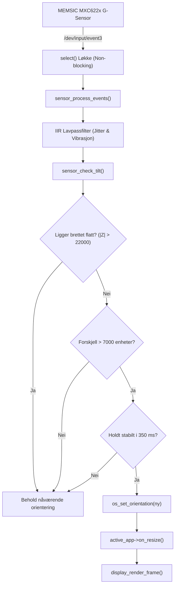

# tabOS - Systemarkitektur og Teknisk Design

Dette dokumentet beskriver den underliggende programvarearkitekturen i **tabOS**, hvordan operativsystemet omgår standard Android-rammeverk og snakker direkte med maskinvaren på Allwinner A13, samt designmønstrene som sikrer 0 ms forsinkelse og sanntidsrespons.

---

## 1. Filosofi og Grunnprinsipper

Tradisjonelle operativsystemer på eldre nettbrett (som Android 4.0 Ice Cream Sandwich) har enorme programvarelag:
* Linux-kjerne $\to$ HAL (Hardware Abstraction Layer) $\to$ `SurfaceFlinger` (komposittør) $\to$ `Zygote` (Java VM) $\to$ Android View Hierarchy.
* Dette resulterte i treg respons, 100–300 ms touch-latens, og høyt minneforbruk (200–350 MB RAM).

**tabOS snur opp-ned på dette:**
1. **Direkte maskinvaretilgang:** Ingen Java VM, ingen X11, ingen SurfaceFlinger.
2. **Ekte sanntid:** tabOS er skrevet i ren C99, kompileres med `-O3` og statisk musl-libc til en selvstendig binærfil på ca. 2 MB.
3. **0 kopier (Zero-Copy):** Skriver direkte til skjermkortets fysiske minne via `mmap()` på `/dev/graphics/fb0`.
4. **Umiddelbar touch-respons:** Interrupt-drevet lesing av I2C-digitizeren `/dev/input/event2` via `select()`.

```mermaid
flowchart TD
    HW_LCD["Allwinner A13 LCD (800x480)"] <--> |"/dev/graphics/fb0 (mmap)"| RENDER["tabOS Display Engine (Blitter)"]
    HW_TOUCH["Zet6221 I2C Touch"] --> |"/dev/input/event2"| INPUT["tabOS Input Engine (Digitizer Scale & Rotate)"]
    HW_AUDIO["sun5i-CODEC & PA (PG10)"] <-- AUDIO["tabOS Audio Engine (8-bit Synth)"]
    HW_WIFI["Realtek 8188eu (wlan0)"] <--> |"TCP/IP Sockets"| BBS["Telehack BBS Terminal"]

    INPUT --> CORE["tabOS Kjerne (Hendelsesløkke & App Manager)"]
    CORE --> APPS["Aktive Applikasjoner (Launcher, Snake, Keyboard, BBS)"]
    APPS --> RENDER
    APPS --> AUDIO
    BBS --> RENDER
```

---

## 2. Skjerm- og Tekstmotor (Display Engine)

Skjermen er organisert som et todimensjonalt rutenett av **ANSI-celler** ([ansi.h](file:///c:/AG-prosjekter/tabOS/include/ansi.h)):

```c
typedef struct {
    uint8_t glyph;  /* 8-bit tegnkode (IBM CP437 / CP865, 0..255) */
    uint8_t fg;     /* 4-bit forgrunnsfarge (0..15 ANSI)          */
    uint8_t bg;     /* 4-bit bakgrunnsfarge (0..15 ANSI)          */
    uint8_t attr;   /* Attributter (fet, invertert, blink osv.)    */
} AnsiCell;
```

### 2.1 Rutenettstørrelser
* **Landskapsmodus (800 x 480 piksler):**
  * Hver tegn-celle er $8 \times 16$ piksler.
  * Antall kolonner: $800 / 8 = 100$
  * Antall rader: $480 / 16 = 30$
  * Totalt: $100 \times 30 = 3\,000$ tegnceller.
* **Portrettmodus (480 x 800 piksler):**
  * Antall kolonner: $480 / 8 = 60$
  * Antall rader: $800 / 16 = 50$
  * Totalt: $60 \times 50 = 3\,000$ tegnceller.

### 2.2 Rasterisering og Piksel-blitting
Hvert tegn i fonten er lagret som 16 bytes (1 byte per pikselrad, 8 piksler bred). Når rammen rendres til framebufferen, utføres en rask bitmaskeoperasjon:

```c
for (int py = 0; py < 16; py++) {
    uint8_t row_bits = glyph_bitmap[py];
    for (int px = 0; px < 8; px++) {
        uint32_t color = (row_bits & (0x80 >> px)) ? fg_color : bg_color;
        fb_target[y * 800 + x] = color;
    }
}
```

---

## 3. Dynamisk 90-graders Skjermrotasjon

Allwinner A13-panelet er fysisk koblet som et $800 \times 480$ landskapspanel. Når brukeren trykker **`[ROTER SKJERM]`**, veksler tabOS til et virtuelt $480 \times 800$ portrett-panel.

For å unngå behov for en tung GPU-komposittør, utfører rasterisereren koordinat-rotasjonen direkte i C under minneskrivingen:

### 3.1 Skjermrotasjon (Virtuell Portrett $\to$ Fysisk Framebuffer)
Gitt virtuell piksel $(x_v, y_v)$ i området $0 \le x_v < 480$, $0 \le y_v < 800$:
$$x_{\text{phys}} = (\text{SCREEN\_PHYS\_WIDTH} - 1) - y_v = 799 - y_v$$
$$y_{\text{phys}} = x_v$$

```c
int x_phys = (SCREEN_PHYS_WIDTH - 1) - yv;
int y_phys = xv;
fb_target[y_phys * SCREEN_PHYS_WIDTH + x_phys] = color;
```

### 3.2 Invers Touch-rotasjon (Fysisk Digitizer $\to$ Virtuell Portrett)
Når brukeren trykker med fingeren i portrettmodus, leverer digitizeren fysiske koordinater $(x_p, y_p)$. tabOS regner dem lynraskt tilbake:
$$x_v = y_p$$
$$y_v = (\text{SCREEN\_PHYS\_WIDTH} - 1) - x_p = 799 - x_p$$

Dette gjør at alle apper kan skrive ren portrett-kode uten å bekymre seg for den fysiske skjermorienteringen!

---

## 4. Input-motor og Touch-kalibrering

Digitizer-brikken **Zet6221** opererer med et internt rutenett på $960 \times 640$ enheter, mens LCD-skjermen er $800 \times 480$ piksler.

tabOS skalerer koordinatene lineært:
```c
*lcd_x = (hw_x * 800) / 960;
*lcd_y = (hw_y * 480) / 640;
```

Hendelsesstrukturen [input.h](file:///c:/AG-prosjekter/tabOS/include/input.h) beregner automatisk:
* `raw_x`, `raw_y`: Piksler på skjermen.
* `grid_col`, `grid_row`: Hvilken tegncelle i rutenettet fingeren treffer.
* `just_down`: Éngangsflagg når fingeren treffer skjermen.
* `just_up`: Éngangsflagg når fingeren slippes (brukes for å trigge knapper).

---

## 5. Telehack BBS & Telnet-protokollmotor

Telehack-appen ([app_bbs.c](file:///c:/AG-prosjekter/tabOS/src/apps/app_bbs.c)) er en fullblods nettverksterminal:

1. **Non-blocking TCP Sockets:**
   * Åpner `socket(AF_INET, SOCK_STREAM, 0)` og setter `O_NONBLOCK`.
   * Kobler til `telehack.com:23` (eller IP `64.13.139.230`).
   * Bruker `select()` i hovedløkken slik at nettverks-I/O aldri låser grensesnittet.
2. **Telnet IAC State Machine:**
   * Håndterer `0xFF` (IAC - Interpret As Command).
   * Forhandler automatisk `SGA` (Suppress Go Ahead) og `ECHO`.
3. **ANSI VT100 / CSI Parser:**
   * Parser farger (`\033[31m`, `\033[0m`, `\033[1;32m`), markørposisjoner (`\033[r;cH`), skjermtømming (`\033[2J`), og linjeskift.
   * Ruller terminalbufferen jevnt oppover ved bunnen av skjermen.

---

## 6. Lydmotor (Audio Engine)

Lydmotoren ([audio.c](file:///c:/AG-prosjekter/tabOS/src/audio.c)) leverer ekte 8-bit arkadelyder:
* Lydene genereres og pakkes som binære PCM WAV-headere i [sounds.h](file:///c:/AG-prosjekter/tabOS/include/sounds.h).
* Ved oppstart verifiseres lydfilene i `/data/local/tmp/`.
* Avspilling skjer via en isolert `fork()` + `execl()` underprosess mot Allwinners Stagefright/ALSA pipeline.
* `SIGCHLD` settes til `SIG_IGN` slik at fullførte lydprosesser ryddes opp umiddelbart av kjernen uten å etterlate zombier.

---

## 7. Bevegelses- og Tiltemotor (Sensor Subsystem)

Tiltemotoren ([sensor.h](file:///c:/AG-prosjekter/tabOS/include/sensor.h), [sensor.c](file:///c:/AG-prosjekter/tabOS/src/sensor.c)) sørger for automatisk deteksjon og justering av skjermorientering:



1. **Non-blocking Event Multiplexing:**
   Akselerometerets Linux-hendelsesnode (`/dev/input/event3`) overvåkes i samme `select()`-kall som berøringsskjermen. Dette eliminerer dedikerte tråder og låser.
2. **IIR Lavpassfilter (Støyreduksjon):**
   Rådata fra I2C-bussen glattes kontinuerlig ut:
   $$\text{filt} = \frac{\text{filt} \times 3 + \text{raw}}{4}$$
3. **Bordflatedeteksjon (Flat table guard):**
   Når brettet legges på et bord, er gravitasjonen konsentrert i Z-aksen ($Z \approx -32\,768$). Sensoren undertrykker automatisk all rotasjon så lenge brettet hviler flatt.
4. **Hysterese og Debouncing:**
   For å hindre at skjermen vipper fram og tilbake ved ~45 graders vinkel, kreves en hysterese-terskel på 7 000 enheter samt en debounce-forsinkelse på 350 ms.
5. **App-oppdatering ved rotasjon:**
   Når orienteringen endres, varsles den aktive appen via `on_resize(cols, rows)`, slik at menyer, spillfelt og terminalbuffere umiddelbart tilpasser seg de nye dimensjonene.
